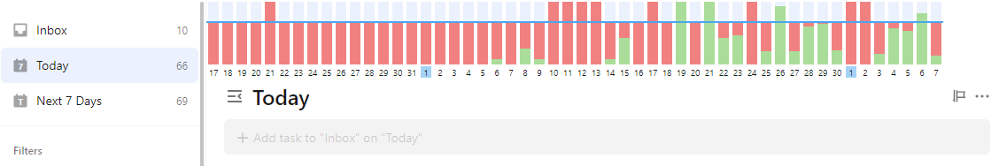
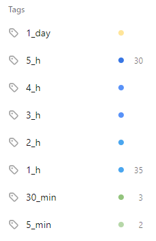
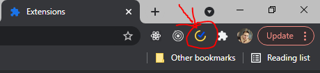

# TickTick productivity chart
> version 0.1.0
> 
>Not published to Chrome Web Store 

### Chart

### Description

Building a histogram of your productivity.

You need to assign the following tags to your tasks: 1_day, 5_h, 4_h, 3_h, 2_h, 1_h, 30_min, 5_min.

Each bar on the histogram represents the productivity of your day, where green is your productive time, red is your procrastination time.

The histogram is built on the basis of counting the amount of time (tags) in closed tasks.

### How to use

- Open [chrome://extensions/](chrome://extensions/)
- Enable "Developer mode"
- Click to "Load unpacked"
- Select 'dist' path
- Check load extension

- Reload TickTick page
- Create time tags and assign their to your tasks
